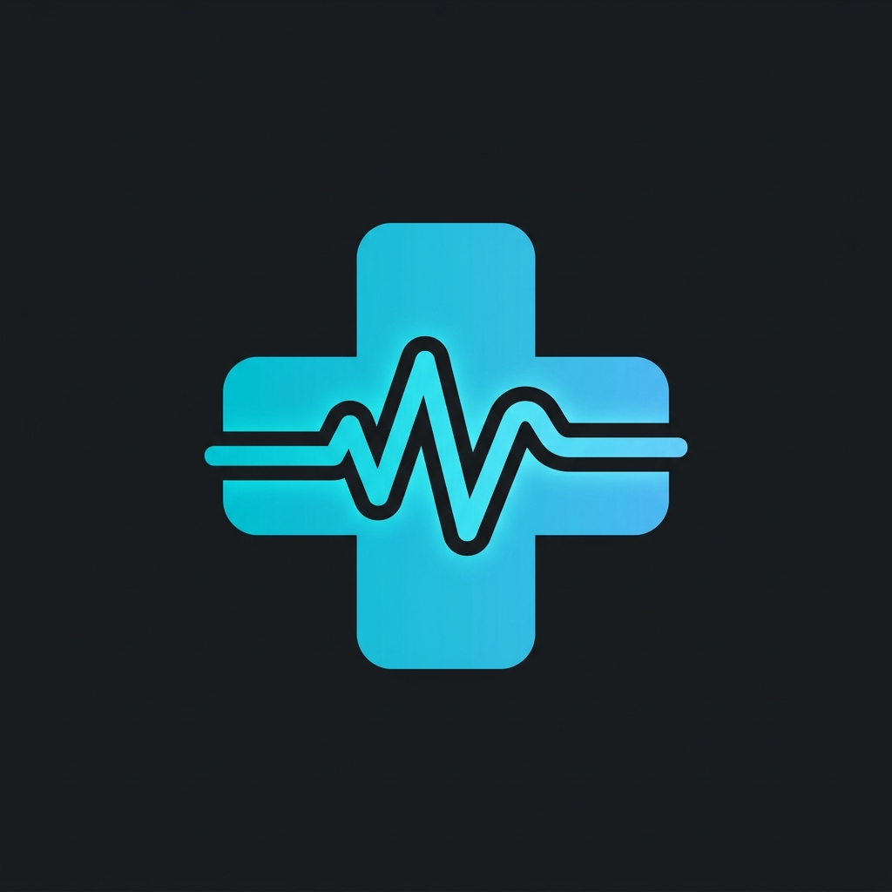

<div align="center">



# MediScan AI

### AI-Powered Medical Diagnostic Platform

[](https://vercel.com)
[](https://ai.google.dev)
[](LICENSE)

**Real-time medical screening using AI — supporting 6 Indian languages, voice input, and blood donor discovery.**

[Live Demo](#) · [Features](#-features) · [Tech Stack](#-tech-stack) · [Setup](#-quick-start)

---

</div>

## 🧬 What is MediScan AI?

MediScan AI is an **AI-powered medical diagnostic web application** that provides preliminary health screening through multiple modalities — camera scanning, voice-based symptom analysis, medical report analysis, and an AI doctor chatbot. Built with accessibility at its core, it supports **6 Indian languages** including Hindi, Kannada, Telugu, Tamil, and Marathi.

> ⚠️ **Disclaimer**: MediScan AI provides **preliminary screening only**. It is NOT a replacement for professional medical diagnosis. Always consult a qualified healthcare provider.

---

## ✨ Features

| Feature | Description |
|---------|-------------|
| 🔍 **AI Skin Scanner** | Upload or capture images for real-time AI-powered skin condition analysis |
| 🎙️ **Voice Symptom Checker** | Describe symptoms by speaking in any supported language |
| 📄 **Medical Report Analyzer** | Upload blood test / lab reports for AI-generated insights & lifestyle tips |
| 💬 **AI Doctor Chat** | Interactive chatbot for health-related questions |
| 🩸 **Blood Donor Network** | GPS-based blood donor map with live location tracking |
| 🌐 **6 Languages** | English, Hindi, Kannada, Telugu, Tamil, Marathi |
| 📥 **PDF Export** | Download analysis reports as PDFs (supports Indic scripts) |
| ♿ **Accessibility** | Text-to-speech, high contrast mode, large text mode |
| 🚨 **Emergency Alerts** | One-tap emergency calling with location sharing |

---

## 🛠️ Tech Stack

| Layer | Technology |
|-------|-----------|
| **Frontend** | HTML5, CSS3 (Glassmorphism), Vanilla JavaScript |
| **AI Engine** | Google Gemini 2.5 Flash (via REST API) |
| **Backend** | Node.js (API proxy for secure key management) |
| **Maps** | Leaflet.js with OpenStreetMap |
| **PDF Generation** | jsPDF + html2canvas |
| **Speech** | Web Speech API (recognition + synthesis) |
| **Deployment** | Vercel (Serverless Functions) |
| **Design** | Custom SVG icon system, Inter + Space Grotesk fonts |

---

## 📸 Screenshots

<div align="center">

| Home Dashboard | AI Scanner | Report Analyzer |
|:-:|:-:|:-:|
| Premium dark UI with stats | Camera + image upload | Multi-language report analysis |

| Symptom Checker | AI Doctor Chat | Blood Donor Map |
|:-:|:-:|:-:|
| Voice input in 6 languages | Interactive AI consultation | GPS-based donor discovery |

</div>

---

## 🚀 Quick Start

### Prerequisites
- **Node.js** v18+
- **Gemini API Key** → Get one free at [aistudio.google.com/apikey](https://aistudio.google.com/apikey)

### Local Development

```bash
# 1. Clone the repo
git clone https://github.com/YOUR_USERNAME/mediscan-ai.git
cd mediscan-ai

# 2. Add your API key
echo "GEMINI_API_KEY=your_key_here" > .env

# 3. Start the server
node server.js

# 4. Open in browser
# → http://localhost:3000
```

### Deploy to Vercel

```bash
# Push to GitHub, then:
# 1. Import repo at vercel.com/new
# 2. Add Environment Variable: GEMINI_API_KEY = your_key
# 3. Deploy!
```

---

## 📁 Project Structure

```
mediscan-ai/
├── api/
│   └── gemini.js          # Vercel serverless API proxy
├── css/
│   ├── styles.css         # Design system & layout
│   ├── components.css     # UI components
│   └── animations.css     # Animations & effects
├── js/
│   ├── app.js             # Main app controller
│   ├── gemini.js          # Gemini API client
│   ├── scanner.js         # AI skin scanner
│   ├── symptoms.js        # Symptom checker
│   ├── report.js          # Report analyzer + PDF
│   ├── chat.js            # AI doctor chat
│   ├── bloodbank.js       # Blood donor map
│   ├── voice.js           # Speech recognition
│   ├── config.js          # App configuration
│   └── accessibility.js   # A11y features
├── img/
│   └── logo.png           # App logo
├── index.html             # Single-page application
├── server.js              # Local dev server
├── vercel.json            # Vercel deployment config
└── .env                   # API key (git-ignored)
```

---

## 🔒 Security

- API key is **never exposed** to the browser
- All AI requests are proxied through a secure server-side endpoint (`/api/gemini`)
- `.env` file is git-ignored to prevent accidental key leaks
- On Vercel, the key is stored in encrypted environment variables

---

## 🌍 Supported Languages

| Language | Code | Voice Input | Text Output | TTS |
|----------|------|:-----------:|:-----------:|:---:|
| English | `en` | ✅ | ✅ | ✅ |
| Hindi | `hi` | ✅ | ✅ | ✅ |
| Kannada | `kn` | ✅ | ✅ | ✅ |
| Telugu | `te` | ✅ | ✅ | ✅ |
| Tamil | `ta` | ✅ | ✅ | ✅ |
| Marathi | `mr` | ✅ | ✅ | ✅ |

---

## 🤝 Team

Built with ❤️ for the Hackathon

---

## 📄 License

This project is licensed under the MIT License.

---

<div align="center">
<strong>MediScan AI</strong> — Making healthcare accessible through AI
</div>
